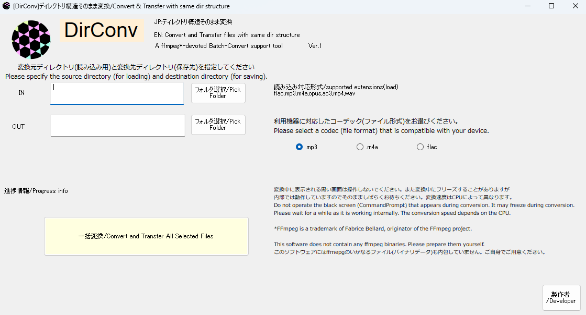

# dirconv
ディレクトリ構造を保ったまま音楽ファイル変換ができるソフトです。昔のゲーム機やカーナビでの音楽再生を支援します!　This software allows you to convert music files while preserving the directory structure. It supports music file conversion for old game consoles and car navigation systems!  
ご利用になられる前にまずお読みください。(事前準備が必要です。)  
  

## 準備 //Prerequisites  
このソフトウェアにはffmpegを同梱しておりません。申し訳ございませんが、個人で準備していただく必要がございます。  
ffmpegにPathを通しておいてください。(ほかのサイト様をご覧になる方が早くて分かりやすいです!)  
準備(やり方)  
1. ffmpegをダウンロードしてください。
3. exeファイルをCドライブ直下にffmpegフォルダを作ってその中にコピーします。
4. 「環境変数を編集」よりユーザー環境変数内にあるPathを編集し、
```
 C:\ffmpeg
 ```
を新規追加します。これで下準備は完了となります!  
上手くできない場合はご連絡ください!  
https://x.com/yokocha_yokoha  
